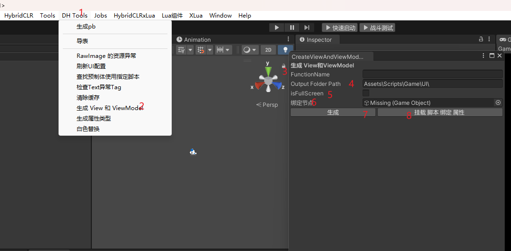

# 代码生成工具

加这个工具的主要目的是为了减少前端无效的重复的工作量，减少开发成本。节约大家时间，这样还规范了大家的代码风格。跟命名习惯。
现在这个是第一版本 ，只支持了 
 - Button (DhButton)
 - Image (DhImage)
 - Text
 - TextMeshProUGUI (DhText)
 - Slider
 - UICircularScrollView
 - ScrollRectExtend
 - StaticItemsBindComponent
 - 自定义脚本组件 前提是你的脚本组件继承自 BaseView 且 你的view 和viewModel类名结构相同
 
 - 后续有需求再加其他的
 - 欢迎大家提出意见跟建议

## 操作指南
 -  首先我们需要创建预制体 这里需要注意的是 需要导出的节点 需要加个后缀 _ex 或者_Ex, 大小写随意
 -  打开工具后，将我们创建好的预制 拖入到工具的 绑定节点中
 -  输入我们的功能名字 这个最好是根据功能命名。首字母大写，结尾不加 View 或者ViewModel
 -  fullScreen 是根据我们当前的这个界面是否是全屏准备的
 -  然后直接点击生成，生成后 unity 会主动属性加载，编译等，完成后，我们再点击挂载跟绑定 
 -  等操作完成后，代码挂载，节点绑定这些就好了，

## 代码生成
 - 代码生成是根据模版类 TemplateView 和 TemplateViewModel 生成的，
 - 生成后如果有没导入的引用可以手动导入 或者添加到 TemplateView 和 TemplateViewModel 里面的导入，再次生成就可以了

## 预制体创建
 - 预制体创建，注意规范一下 首字母大小
 - 需要导出的节点需要加后缀 _ex 或者_Ex
## 关于工具
 - 工具的类名 CreateViewAndViewModelCode ，有需要的话可以做改动
## 后续
 - 20240711
 - 更新了支持 StaticItemsBindComponent 组件
 -  支持了用预制体名字 为脚本名字 如果名字 是以 view 结尾的 功能名字会自动删除 view 
 -  支持了 主动创建文件夹 ，如果文件夹不存在会自动创建
 -  支持了脚本存在 主动报错，如果脚本存在 不会覆盖
 -  新增了文件路径检查，没在指定路径(Assets\Scripts\Game\UI\)下 主动报错 不会生成